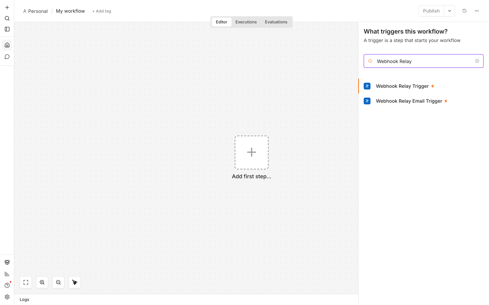
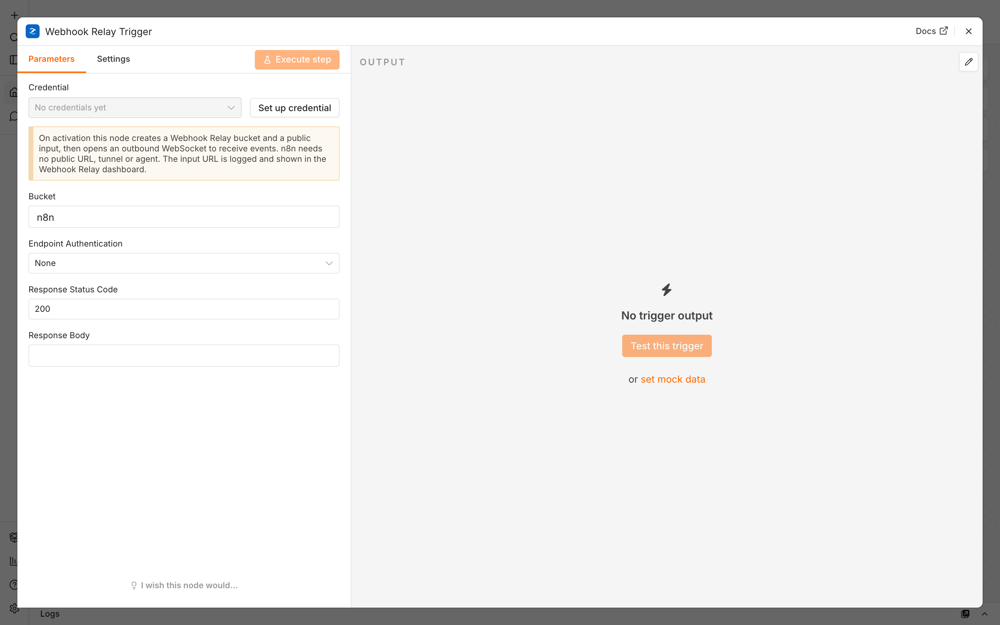

# n8n-nodes-webhookrelay

**Receive webhooks and inbound email in self-hosted n8n — no public IP, no port
forwarding, no tunnel, and n8n never exposed to the internet.**

n8n community nodes for [Webhook Relay](https://webhookrelay.com). Webhook Relay
gives your provider a stable, public URL (or email address), verifies and answers
the sender for you, and queues each event. The node then **opens an outbound
WebSocket from n8n to Webhook Relay** and receives events over it — so n8n can
stay on `localhost` or behind a firewall/NAT and **never listens for inbound
connections**. No tunnel, no relay agent, nothing to expose.

```
Provider ──HTTP──► Webhook Relay (public URL, auth + response)
                        │
        n8n ──outbound WebSocket──┘   ← n8n connects out; nothing inbound
```

## Nodes

| Node | Description |
| --- | --- |
| **Webhook Relay Trigger** | Receive HTTP webhooks (Stripe, GitHub, Shopify, …) with endpoint authentication and a custom response. |
| **Webhook Relay Email Trigger** | Trigger a workflow from inbound **email** sent to a generated address. |



## Installation

In n8n: **Settings → Community Nodes → Install** and enter:

```
n8n-nodes-webhookrelay
```

Or install manually in a self-hosted instance:

```bash
npm install n8n-nodes-webhookrelay
```

## Credentials

Create an **API key** (`sk-…`) at
[my.webhookrelay.com/tokens](https://my.webhookrelay.com/tokens) and add it as a
**Webhook Relay API** credential (a classic token key/secret pair also works).

## Usage

Add a **Webhook Relay Trigger**, pick a bucket name, optionally set endpoint
authentication and the response returned to the sender, then activate the
workflow. On activation the node provisions the bucket and a public input in
Webhook Relay (enabling streaming so events flow over the socket), logs the
public URL (also shown in the dashboard), and opens the WebSocket. Give that URL
to your provider — webhooks arrive over the socket.

The node's **Public URL** field shows the exact URL to hand your provider (e.g.
`https://<id>.hooks.webhookrelay.com`) — open that dropdown (or click its refresh
icon) to load it. The **Email Trigger** has an **Email Address** field that works
the same way. Bucket and input are find-or-created and never deleted, so the
URL/address stays stable.

**Test vs activate:** *Test this trigger* captures a **single** event so you can
build the workflow, then stops — that's expected. **Activate** the workflow to
receive events continuously. The connection replies to server pings, sends its
own keepalive ping every 15 s, and reconnects immediately if it drops.

**Per-output delivery:** each trigger also creates an internal **output**
(`n8n` for the webhook trigger, `n8n-email` for the email trigger; destination
`http://localhost`, so nothing is ever HTTP-forwarded to it) and subscribes to
just that output. This isolates the node from any other outputs on the bucket
and lets you tune per-output options in the Webhook Relay dashboard. Note: **throttling** does pace socket delivery, but **durable
delivery does not** make the socket loss-proof — a passive socket subscriber
that's disconnected when an event is published won't receive it later. For
guaranteed delivery use the durable pull queue (`GET /v1/events`) instead. The
output is find-or-created and never modified on reuse, so your dashboard
settings are preserved.



See the full walkthrough with screenshots in
**[docs/testing-with-n8n.md](docs/testing-with-n8n.md)**.

## Local development

```bash
npm install
npm run build          # tsc + copy icons → dist/
```

Then load the built nodes into a local n8n with the Docker setup in
[`docker/`](docker/docker-compose.yml) (see the
[`n8n-local-testing` skill](skills/n8n-local-testing/SKILL.md)):

```bash
cd docker && docker compose up
# open http://localhost:5678
```

The compose file mounts just the built package into `~/.n8n/custom` — the nodes
have **zero runtime dependencies** (they use the runtime's built-in `WebSocket`
and n8n's own `n8n-workflow`), so there's no `node_modules` to mount and no
`--tunnel` to run. Rebuild and `docker compose restart` to reload changes.

## Compatibility

- n8n `>= 1.x` (verified on 2.x)
- **Zero runtime dependencies.** Events are received over the runtime's built-in
  global `WebSocket` (Node.js `>= 22`) — n8n's official images already ship
  Node 22+/24, so there's nothing to install.

## Resources

- [Webhook Relay docs](https://webhookrelay.com/docs/)
- [Webhook Relay API reference](https://webhookrelay.com/docs/api/)
- [n8n community nodes](https://docs.n8n.io/integrations/community-nodes/)

## License

[MIT](LICENSE)
