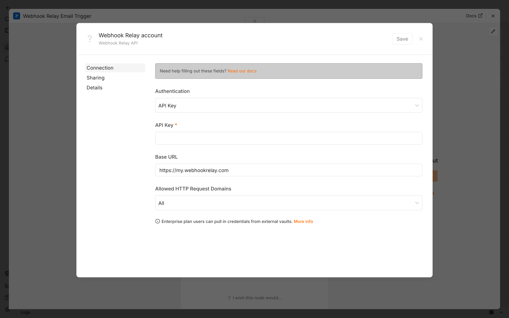
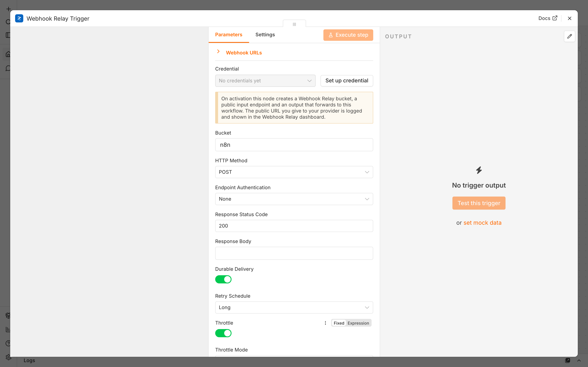
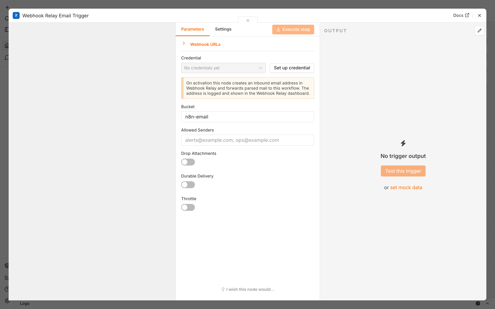

# Using the Webhook Relay nodes in n8n

This walkthrough shows how to receive webhooks and inbound email in n8n through
[Webhook Relay](https://webhookrelay.com) — with **durable delivery**,
**throttling**, **endpoint authentication** and a **custom response**, none of
which the built-in Webhook node offers.

There are two trigger nodes:

| Node | Use it to… |
| --- | --- |
| **Webhook Relay Trigger** | Receive HTTP webhooks from any provider (Stripe, GitHub, Shopify, …) |
| **Webhook Relay Email Trigger** | Trigger a workflow from inbound **email** |

## How it works

On activation, a trigger node provisions three things in your Webhook Relay
account and tears them down when you deactivate:

1. a **bucket** (created if missing),
2. a public **input** — the URL/address you give your provider (with your
   chosen authentication and response), and
3. an **output** that forwards each event to this workflow, applying **durable
   delivery** and **throttling**.

```
Provider ──► Webhook Relay input ──►  output (durable + throttled) ──► n8n workflow
             (auth + response)
```

Because Webhook Relay answers the sender immediately with your configured
response and then delivers to n8n out of band, your workflow can be slow, retry,
or briefly go down without the provider ever seeing an error.

## 1. Install the nodes

**From npm (recommended):** in n8n go to **Settings → Community Nodes →
Install** and enter `n8n-nodes-webhookrelay`.

**For local development:** see [`skills/n8n-local-testing`](../skills/n8n-local-testing/SKILL.md)
for a Docker setup that loads the built nodes and exposes n8n publicly via a
tunnel.

Both trigger nodes then appear in the node picker:


## 2. Add the Webhook Relay credential

Add a **Webhook Relay Trigger** node, then next to **Credential** choose *Set up
credential*. Paste an **API key** (`sk-…`) from
[my.webhookrelay.com/tokens](https://my.webhookrelay.com/tokens) and **Save**
(the *Test* button verifies it against the API). A classic token key/secret pair
is also supported.



## 3. Configure the trigger


| Setting | What it does |
| --- | --- |
| **Bucket** | Webhook Relay bucket to use (created automatically). |
| **HTTP Method** | The method your provider sends (usually `POST`). |
| **Endpoint Authentication** | `None`, `Basic Auth`, or `Token` — callers must authenticate to your public URL. |
| **Response Status Code / Body** | The response Webhook Relay returns to the sender immediately. |
| **Durable Delivery** | Persist and retry delivery to n8n over a long window if the workflow is down. Pick a **Retry Schedule** (Seconds / Medium / Long). |
| **Throttle** | Cap delivery rate (events per second/minute/hour) or concurrency. |

Enabling **Durable Delivery** and **Throttle** reveals their options:



Save and **Activate** the workflow. The public URL is written to the n8n logs
and shown in the Webhook Relay dashboard:

```
[Webhook Relay] Send POST webhooks to: https://my.webhookrelay.com/v1/webhooks/<id> (bucket "n8n")
```

Send a request to that URL and the workflow runs.

## 4. Triggering from email

The **Webhook Relay Email Trigger** works the same way but mints an inbound
**email address** instead of an HTTP endpoint. Mail sent to it is parsed and
delivered to your workflow; restrict senders with **Allowed Senders**.



On activation the address is logged and shown in the dashboard:

```
[Webhook Relay] Send email to: <id>@<your-inbound-domain> (bucket "n8n-email")
```

## Payload shape

Each execution item contains the received request:

```json
{
  "headers": { "content-type": ["application/json"], "user-agent": ["Stripe/1.0"] },
  "params": {},
  "query": { "foo": "bar" },
  "body": { "id": "evt_123", "type": "payment_intent.succeeded" }
}
```

For the email trigger, `body` holds the parsed message (from, subject, text,
html, attachments).
